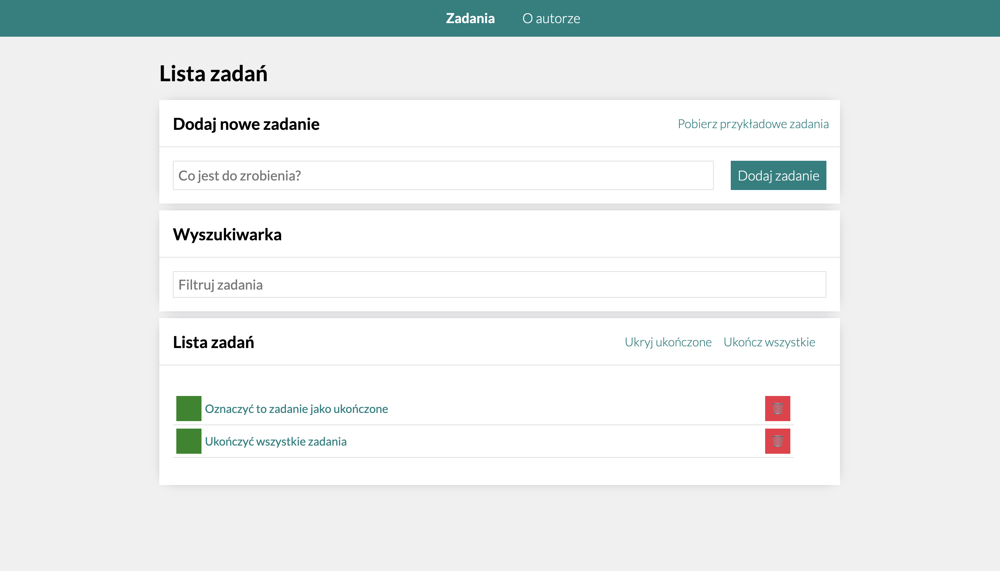

# To-Do List

This project is a to-do list web application built with React, using JSX syntax. The application allows users to add tasks, change their status or remove them. Also, users can hide already completed tasks or finish all tasks with one click of a button. The application now includes additional features such as task filtering and the ability to download sample tasks.

## Table of Contents

- [Technologies Used](#technologies-used)
- [Usage](#usage)
- [Screenshots](#screenshots)

## Technologies Used

The following technologies were used in this project:

- React
- JSX
- BEM
- normalize.css
- styled-components
- Redux
- Redux Saga

## Usage

To use the application, simply navigate to the [to-do list page](https://pawelmroczek.github.io/todo-list-react/) and follow these steps:

1. Input a task you wish to add
2. Click the "Dodaj zadanie" button to add the task to the list
3. Click on the checkbox to mark a task as completed
4. Click the "🗑" button to remove a task from the list
5. Click the "Ukryj ukończone" button to hide all completed tasks
6. Click the "Ukończ wszystkie" button to mark all tasks as completed
7. Click the "Pobierz przykładowe zadania" button to fetch sample tasks
8. Input a filter in "Wyszukiwarka"

## Screenshots

Here is a screenshot of the to-do list page:

Thank you for using the To-Do List!

## Getting Started with Create React App

This project was bootstrapped with [Create React App](https://github.com/facebook/create-react-app).

## Available Scripts

In the project directory, you can run:

### `npm start`

Runs the app in the development mode.\
Open [http://localhost:3000](http://localhost:3000) to view it in your browser.

The page will reload when you make changes.\
You may also see any lint errors in the console.

### `npm run build`

Builds the app for production to the `build` folder.\
It correctly bundles React in production mode and optimizes the build for the best performance.

The build is minified and the filenames include the hashes.\
Your app is ready to be deployed!

See the section about [deployment](https://facebook.github.io/create-react-app/docs/deployment) for more information.

### `npm run eject`

**Note: this is a one-way operation. Once you `eject`, you can't go back!**

If you aren't satisfied with the build tool and configuration choices, you can `eject` at any time. This command will remove the single build dependency from your project.

Instead, it will copy all the configuration files and the transitive dependencies (webpack, Babel, ESLint, etc) right into your project so you have full control over them. All of the commands except `eject` will still work, but they will point to the copied scripts so you can tweak them. At this point you're on your own.

You don't have to ever use `eject`. The curated feature set is suitable for small and middle deployments, and you shouldn't feel obligated to use this feature. However we understand that this tool wouldn't be useful if you couldn't customize it when you are ready for it.

## Learn More

You can learn more in the [Create React App documentation](https://facebook.github.io/create-react-app/docs/getting-started).

To learn React, check out the [React documentation](https://reactjs.org/).

### Code Splitting

This section has moved here: [https://facebook.github.io/create-react-app/docs/code-splitting](https://facebook.github.io/create-react-app/docs/code-splitting)

### Analyzing the Bundle Size

This section has moved here: [https://facebook.github.io/create-react-app/docs/analyzing-the-bundle-size](https://facebook.github.io/create-react-app/docs/analyzing-the-bundle-size)

### Making a Progressive Web App

This section has moved here: [https://facebook.github.io/create-react-app/docs/making-a-progressive-web-app](https://facebook.github.io/create-react-app/docs/making-a-progressive-web-app)

### Advanced Configuration

This section has moved here: [https://facebook.github.io/create-react-app/docs/advanced-configuration](https://facebook.github.io/create-react-app/docs/advanced-configuration)

### Deployment

This section has moved here: [https://facebook.github.io/create-react-app/docs/deployment](https://facebook.github.io/create-react-app/docs/deployment)

### `npm run build` fails to minify

This section has moved here: [https://facebook.github.io/create-react-app/docs/troubleshooting#npm-run-build-fails-to-minify](https://facebook.github.io/create-react-app/docs/troubleshooting#npm-run-build-fails-to-minify)
